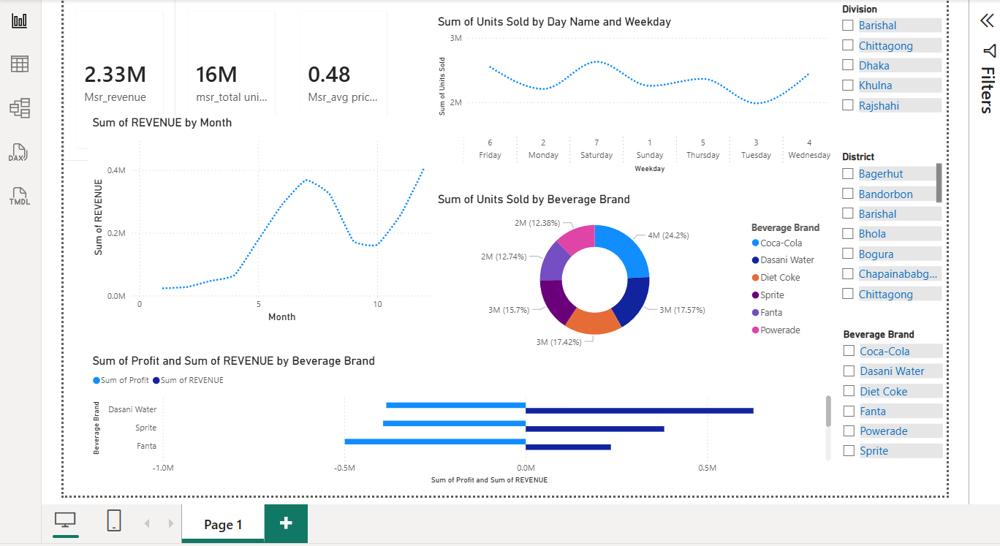

# Power BI Beverage Sales Dashboard
## Objective
An interactive Power BI dashboard analyzing beverage sales performance — revenue, units sold, pricing, and brand mix — across divisions and districts.This project visualizes beverage sales data for a distribution business operating across multiple divisions and districts in Bangladesh. It brings together revenue, volume, pricing, and profitability metrics for six beverage brands (Coca-Cola, Dasani Water, Diet Coke, Sprite, Fanta, Powerade) into a single interactive report.

**Goals of the dashboard:**
- Track overall sales performance (revenue, units sold, average price) at a glance via KPI cards
- Identify seasonal/monthly revenue trends
- Understand sales patterns by day of week
- Compare brand performance by volume, profit, and revenue contribution
- Let stakeholders slice the data by Division, District, and Beverage Brand to drill into specific regions or products

**Target audience:** sales managers, regional analysts, and business stakeholders who need a quick, filterable view of beverage sales performance without querying raw data.

## Preview



## 📊 Report Overview

**Single-page dashboard** with:

- **Filters (Slicers):** Division, District, Beverage Brand
- **KPI Cards:** Sum of Revenue, Total Units Sold, Average Price per Unit
- **Sum of Revenue by Month** — line chart showing revenue trend across the year
- **Sum of Units Sold by Day Name and Weekday** — line chart showing sales pattern by day
- **Sum of Units Sold by Beverage Brand** — donut chart showing brand mix (Coca-Cola, Dasani Water, Diet Coke, Sprite, Fanta, Powerade)
- **Sum of Profit and Sum of Revenue by Beverage Brand** — diverging bar chart comparing profit vs. revenue per brand

## 🗂 Data Model

| Table | Sample Fields |
|---|---|
| `Data` | Beverage Brand, District, Division, Month, Revenue, Units Sold, Avg Price per Unit, Profit |
| `Cost` | Beverage Brand |
| `Dates` | Day Name, Weekday |

## 📐 Measures & Calculation Process

The dashboard uses the following DAX measures, built on top of the `Data` table:

| Measure | Logic | DAX (typical pattern) |
|---|---|---|
| **Msr_revenue** | Sum of revenue across all transactions | `Msr_revenue = SUM(Data[REVENUE])` |
| **msr_total unit sold** | Sum of total units sold across all transactions | `msr_total unit sold = SUM(Data[Units Sold])` |
| **Msr_avg price per unit** | Average selling price, calculated as total revenue divided by total units sold (not a simple column average, to avoid skew from mixed order sizes) | `Msr_avg price per unit = DIVIDE([Msr_revenue], [msr_total unit sold])` |
| **Sum of Profit** | Sum of profit across all transactions | `SUM(Data[Profit])` |

**Process:**
1. Base columns (`REVENUE`, `Units Sold`, `Profit`) are loaded directly from the source table.
2. Explicit measures (prefixed `Msr_`/`msr_`) are created rather than relying on implicit aggregations, so they stay consistent across all visuals and respect slicer/filter context (Division, District, Beverage Brand).
3. `Msr_avg price per unit` uses `DIVIDE()` instead of `/` to safely handle zero-unit cases without throwing a divide-by-zero error.
4. All measures respond dynamically to the report's filters/slicers since they're calculated at query time, not pre-aggregated.

> **Note:** DAX formulas above are reconstructed from the measure names and standard Power BI conventions — the `.pbix` data model is stored in a compiled binary format that can't be read outside Power BI Desktop. If your actual formulas differ, replace this table with the exact DAX from **Data → Measure → Edit** in Power BI Desktop for full accuracy.

- **Power BI Desktop** (2026.04 release or later recommended, to match the report's theme file)
- No external data connections required beyond what's embedded in the `.pbix`

## 📁 Repository Structure

```
.
├── powerbi-bevarage-sales-dashboard.pbix   # Power BI report file
├── screenshots/
│   └── dashboard-page1.png                 # Report preview image
├── README.md
└── .gitignore
```

## ▶️ How to Use

1. Clone this repository.
2. Open `powerbi-bevarage-sales-dashboard.pbix` in Power BI Desktop.
3. Use the slicers (Division, District, Month) to filter and explore sales performance.

## 📝 Notes

- This repo tracks the `.pbix` file directly. Since Power BI files are binary, diffs between versions won't be human-readable in `git diff` — consider [pbi-tools](https://github.com/pbi-tools/pbi-tools) if you need meaningful version control on report internals.
- No sensitive/live data connections are included; all data is embedded in the file.
- This dashboard is the sales-focused counterpart to a related HR workforce analytics project.

## 📄 License

Add a license of your choice (e.g., MIT) if you intend this to be reused by others.
